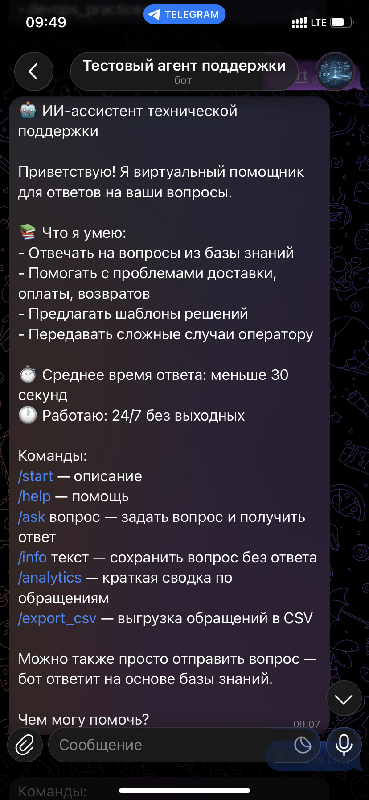
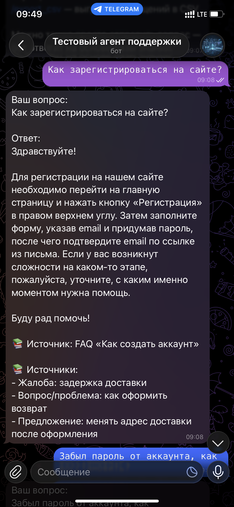
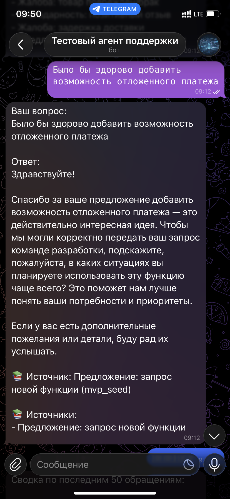

<div align="center">

# 🤖 AI Support & FAQ Assistant / ИИ-ассистент техподдержки и FAQ


**Кастомный ИИ-ассистент для автоматизации технической поддержки и обработки FAQ**

[Описание проекта](#-описание-проекта) • [Возможности](#-возможности) • [Технологии](#-технологии) • [Архитектура проекта](#-архитектура-проектаи) • [Скриншоты](#-скриншоты) • [Быстрый старт](#-быстрый-старт) • [Интеграции](#-интеграции) • [База знаний](#-база-знаний) • [API Reference](#-api-reference) • [Структура проекта](#-структура-проекта) • [Тестирование](#-тестированиея) • [Аналитика](#-аналитика) • [Безопасность](#-безопасность) • [Контакты](#-контакты)

</div>

---

## 📋 Описание проекта

**ИИ-ассистент техподдержки и FAQ** — это готовое решение для автоматизации первой линии поддержки клиентов. Ассистент использует технологию RAG (Retrieval-Augmented Generation) для предоставления точных ответов на основе вашей базы знаний.

### 🎯 Цель проекта

Создать кастомного нейроассистента, способного вести поддержку клиентов в текстовом формате и значительно сократить нагрузку на сотрудников техподдержки.

### 💼 Бизнес-задачи

| Задача | Решение |
|--------|---------|
| **Снижение нагрузки на 1-ю линию** | Автоматизация до 80% типовых обращений |
| **Обработка типовых вопросов** | Мгновенные ответы из базы знаний 24/7 |
| **Повышение скорости ответа** | Среднее время ответа < 30 секунд |
| **Доступность поддержки** | Работа без выходных и перерывов |
| **Снижение затрат** | Экономия до 60% на операционных расходах |

---

## ✨ Возможности

### 🔹 Для клиентов

- 💬 **Мгновенные ответы** на вопросы 24/7
- 📚 **Точная информация** из базы знаний компании
- 🔗 **Ссылки на источники** в каждом ответе
- 📱 **Мультиплатформенность** (сайт, приложение, мессенджеры)
- 👤 **Персонализация** по имени и истории обращений
- 🚀 **Эскалация на оператора** при необходимости

### 🔹 Для бизнеса

- 📊 **Аналитика обращений** и удовлетворённости
- 📈 **Метрики эффективности** ассистента
- 🔄 **Легкое обновление** базы знаний
- 🔐 **Безопасность данных** и соответствие GDPR
- 🎨 **Кастомизация** под бренд компании
- 🔗 **Готовые интеграции** с CRM и Help Desk

---

## 🛠 Технологии

| Категория | Технологии |
|-----------|------------|
| **Язык** | Python 3.10+ |
| **LLM** | OpenAI GPT-4.1-mini / GPT-4o |
| **Эмбеддинги** | OpenAI text-embedding-3-small |
| **Векторная БД** | ChromaDB |
| **RAG** | Retrieval-Augmented Generation |
| **Хранение** | SQLite / PostgreSQL |
| **API** | RESTful API |
| **Интеграции** | Telegram, WhatsApp, Zendesk, Битрикс24 |

---

## 🏗️ Архитектура

```
┌─────────────────────────────────────────────────────────┐
│                    Клиентские каналы                    │
│    (Сайт / Мобильное приложение / Мессенджеры)          │
└─────────────────────────────────────────────────────────┘
                          │
                          ▼
┌─────────────────────────────────────────────────────────┐
│                   ИИ-ассистент                          │
│         (Классификация → RAG-поиск → Генерация)         │
└─────────────────────────────────────────────────────────┘
                          │
              ┌───────────┴───────────┐
              ▼                       ▼
┌─────────────────────────┐   ┌─────────────────────────┐
│    Векторная БД         │   │    База знаний          │
│    (ChromaDB)           │   │    (CSV / PDF / MD)     │
└─────────────────────────┘   └─────────────────────────┘
              │                       │
              └───────────┬───────────┘
                          ▼
┌─────────────────────────────────────────────────────────┐
│                   Логирование и аналитика               │
│              (SQLite / Экспорт в CSV/JSON)              │
└─────────────────────────────────────────────────────────┘
```

### Поток обработки запроса

```
Запрос клиента
      ↓
Классификация (тема, тональность, срочность)
      ↓
RAG-поиск в базе знаний (ChromaDB / CSV)
      ↓
Генерация ответа с цитированием источников
      ↓
Проверка ограничений и политик
      ↓
Ответ клиенту + сохранение в лог
      ↓
Эскалация (если требуется оператор)
```

---

## 📸 Скриншоты

### Главное меню и `/start`



### Примеры обработки отзывов





### Аналитика


> 📌 **Примечание:** остальные скриншоты работы ассистента доступны в папке `docs/images/`

---

## 🚀 Быстрый старт

### Предварительные требования

- Python 3.10 или выше
- API-ключ OpenAI (или совместимого провайдера)
- (Опционально) Токен Telegram-бота

### 1. Клонирование репозитория

```bash
git clone https://github.com/your-username/ai-support-faq-assistant.git
cd ai-support-faq-assistant
```

### 2. Установка зависимостей

```bash
python -m venv .venv
.\.venv\Scripts\activate  # Windows
source .venv/bin/activate  # Linux/Mac

pip install -r requirements.txt
```

### 3. Настройка переменных окружения

```bash
copy .env.example .env
notepad .env
```

**Минимальная конфигурация:**
```bash
OPENAI_API_KEY=your_api_key_here
OPENAI_BASE_URL=https://api.proxyapi.ru/openai/v1
OPENAI_MODEL=gpt-4.1-mini
TELEGRAM_BOT_TOKEN=your_bot_token  # если используется Telegram
```

### 4. Подготовка базы знаний

```bash
# Сгенерировать CSV и PDF из шаблонов
python -m app.tools.build_kb

# Индексировать в ChromaDB
python -m app.tools.ingest_kb
```

### 5. Запуск ассистента

```bash
# Telegram-бот
python -m app.bot

# Или тестовый режим (консоль)
python -m app.console

# Или веб-интерфейс
python -m app.web
```

---

## 🔗 Интеграция

### Веб-интерфейс (Streamlit)

**Быстрый запуск:**
```bash
pip install streamlit
python -m app.web
```

Откроется чат в браузере: http://localhost:8501

**Подробности:** см. [docs/integration_guide.md](docs/integration_guide.md)

### Telegram

**Готовый бот:** создайте через [@BotFather](https://t.me/BotFather)

**Команды:**
- `/start` — приветствие
- `/help` — справка
- `/ask вопрос` — получить ответ
- `/analytics` — статистика

### REST API

**Пример запроса:**
```bash
curl -X POST https://api.proxyapi.ru/openai/v1/chat/completions \
  -H "Authorization: Bearer YOUR_API_KEY" \
  -H "Content-Type: application/json" \
  -d '{
    "model": "gpt-4.1-mini",
    "messages": [{"role": "user", "content": "Как оформить возврат?"}]
  }'
```

**Документация API:** [docs/api_reference.md](docs/api_reference.md)

### CRM-системы

Интеграция через вебхуки или REST API. Примеры:
- **Битрикс24**: вебхук на /api/webhook
- **amoCRM**: вебхук на /api/webhook
- **Salesforce**: middleware через API Gateway

---

## 📚 База знаний

### Форматы данных

| Формат | Назначение | Файл |
|--------|------------|------|
| **CSV** | FAQ, шаблоны, сценарии | `knowledge_base/knowledge_base.csv` |
| **PDF** | Документы, инструкции | `knowledge_base/*.pdf` |
| **Markdown** | Промпты, руководства | `docs/*.md` |

### Структура записей

```csv
id,title,content,type,tags,source
faq_001,Как создать аккаунт?,Чтобы создать...,faq,"регистрация,аккаунт",kb_seed
```

**Типы записей:**
- `faq` — часто задаваемые вопросы
- `document` — политики, регламенты
- `template` — шаблоны ответов
- `scenario` — сценарии обработки
- `policy` — правила и условия
- `escalation` — процедуры эскалации

### Обновление базы знаний

```bash
# 1. Отредактируйте knowledge_base/knowledge_base.csv
# 2. Пересоберите базу
python -m app.tools.build_kb

# 3. Переиндексируйте в ChromaDB
python -m app.tools.ingest_kb
```

**Подробности:** [docs/update_instructions.md](docs/update_instructions.md)

---

## 📡 API Reference

### Основные эндпоинты

| Метод | Эндпоинт | Описание |
|-------|----------|----------|
| POST | `/v1/chat/message` | Отправить сообщение |
| GET | `/v1/chat/session/{id}/history` | История диалога |
| POST | `/v1/chat/escalate` | Передать оператору |
| GET | `/v1/analytics/summary` | Статистика |
| POST | `/v1/kb/update` | Обновить базу знаний |

### Пример ответа

```json
{
  "success": true,
  "data": {
    "response_id": "resp_abc123",
    "message": "Здравствуйте! Оформить возврат можно в течение 14 дней...",
    "sources": [
      {
        "id": "faq_006",
        "title": "Как оформить возврат средств",
        "relevance_score": 0.92
      }
    ],
    "suggested_actions": [
      {"label": "Оформить возврат", "url": "/returns/new"}
    ]
  }
}
```

---

## 📁 Структура проекта

```
ai-support-faq-assistant/
├── README.md                    # Этот файл
├── LICENSE                      # Лицензия MIT
├── requirements.txt             # Зависимости Python
├── .env.example                 # Шаблон переменных окружения
├── .gitignore                   # Исключения Git
│
├── app/
│   ├── __init__.py
│   ├── bot.py                   # Telegram-бот
│   ├── config.py                # Конфигурация
│   ├── db.py                    # SQLite хранилище
│   ├── llm.py                   # LLM интеграция
│   ├── logging_setup.py         # Логирование
│   ├── prompts.py               # Загрузка промптов
│   ├── rag.py                   # ChromaDB RAG
│   ├── rag_csv.py               # CSV fallback RAG
│   ├── web.py                   # Streamlit веб-интерфейс
│   └── tools/
│       ├── build_kb.py          # Генерация базы знаний
│       ├── ingest_kb.py         # Индексация в ChromaDB
│       ├── ingest_pdf.py        # Загрузка PDF
│       ├── pdf_parser.py        # Парсинг PDF
│       └── run_tests.py         # Автоматическое тестирование
│
├── docs/
│   ├── system_prompt.md         # Системный промпт
│   ├── update_instructions.md   # Инструкция по обновлению
│   ├── integration_guide.md     # Руководство по интеграции
│   ├── test_dataset_20.md       # Тестовые данные
│   ├── analytics_report_example.md  # Пример отчёта
│   ├── QUICKSTART.md            # Быстрый старт
│   └── images/                  # Скриншоты
│
├── knowledge_base/
│   ├── knowledge_base.csv       # База знаний (CSV)
│   └── knowledge_base.pdf       # База знаний (PDF)
│
└── data/
    ├── queries.sqlite           # SQLite база (создаётся)
    └── chroma/                  # ChromaDB (создаётся)
```

---

## 🧪 Тестирование

### Запуск тестов

```bash
# Базовые тесты
python -m pytest tests/

# Тесты RAG
python -m pytest tests/test_rag.py

# Тесты промпта
python -m pytest tests/test_prompts.py
```

### Тестовый датасет

Используйте `docs/test_dataset_20.md` для проверки качества ответов.

---

## 📊 Аналитика

### Доступные метрики

- Количество диалогов
- Процент решённых без эскалации
- Среднее время ответа
- Удовлетворённость клиентов (CSAT)
- Топ вопросов
- Часы пиковой нагрузки

### Экспорт данных

```bash
# Через Telegram-бота
/export_csv

# Через API
GET /v1/analytics/export?format=csv
```

---

## 🔐 Безопасность

- ✅ HTTPS для всех соединений
- ✅ Шифрование данных (AES-256)
- ✅ Соответствие GDPR
- ✅ Rate limiting (100 запросов/мин)
- ✅ Логирование без персональных данных

---

## 📄 Лицензия

MIT License — подробности в файле [LICENSE](LICENSE)

---

## 📞 Контакты

**Автор:** Ivan P  
**Telegram:** [@nonoyessure](https://t.me/nonoyessure)  

---

<div align="center">

**⭐ Ставь звезду в любом случае!**

🚀

</div>
